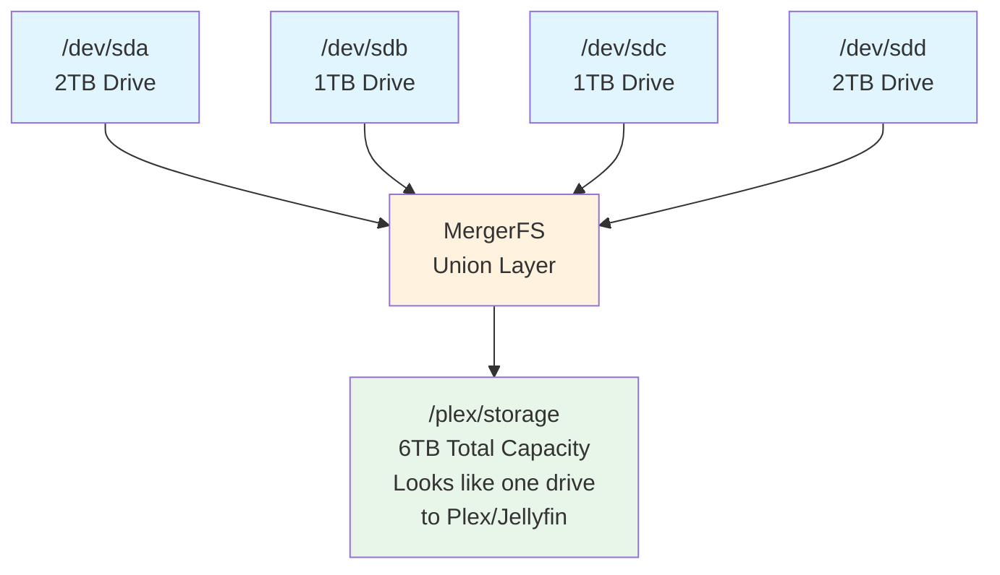

# rip - DVD and TV Show Ripper

Transform your physical DVD and TV show collection into a modern streaming library on Plex or Jellyfin.  This isn't a guide on how to install Plex or Jellyfin, but rather a tool to help you rip and organize your media for those platforms.
What I did. I went to Google Gemini and told it I wanted to repurpose an old Intel Nuc 10 with 32 gigs of ram. I had a few spare 2TB drives lying around, so I installed Ubuntu Server 24.04 LTS on the Nuc, set up MergerFS to pool the drives into a single mount point at /plex/storage, and then built this rip tool to automate ripping my DVD collection. Now I can stream all my movies and TV shows directly to my smart TV and other devices without needing the physical discs.  I just put a dvd into the drive of my server, run a simple command, and it rips, organizes, and names everything perfectly for Plex. No more hunting for discs or dealing with cluttered shelves!

### Legal Notice: 
This tool is intended for personal use to back up media you own, and will continue to own. Always comply with copyright laws in your jurisdiction. Do NOT sell, donate, or distribute ripped content or the physical copy of that movie! This is stealing. This tool was not designed to promote illegal activity but one to facilitate personal backups of legally owned media. You must maintain the original physical media after ripping, nor should you distribute the MKV files it produces. But hey you're an adult, so do what you want. Just don't blame me if you get sued. Many times you can find DVDs on sale, or go to your local thrift store. They've got tons of them, sure they're older but for $1-$3 a pop, it's worth it to build your digital library legally. 

## Purpose

**rip** is a command-line tool that automates the process of converting your personal DVD and TV show collection into a digital format compatible with media servers like Plex and Jellyfin.

This gives you a front end to MakeMKV and FileBot to rip and organize your DVDs and TV shows into a Plex or Jellyfin compatible format. It handles:
- Detecting movie title from your DVD drive
- Fetching metadata from TheMovieDB (movies) and TheTVDB (TV shows)
- Extracting video using MakeMKV
- Organizing files into a Plex/Jellyfin-compatible directory structure
- Renaming files with proper episode/movie titles
- Ejecting the disc when done (Linux version)

### Contribution / Bugs
This software isn't perfect, but you get what you paid for right? If you find bugs or have feature requests, please open an issue or submit a pull request on GitHub. Contributions are welcome!

**License Note**: This project is licensed under the Business Source License (BSL 1.1). You are free to use, modify, and distribute this software for **non-commercial purposes**. For commercial use, please contact Richard Masci at rmasci@github.com to discuss licensing arrangements. See the [LICENSE](LICENSE) file for full details.

### Why Use rip?

- **Reclaim Your Space**: Box away your DVDs and store them in the garage instead of taking up shelf space
- **Netflix-like Experience**: Stream your collection on your smart TV, Fire Stick, Google TV, Chromecast, or Roku device
- **Protect your investment**: Physical media can degrade over time; digital copies ensure longevity. I hate it when I go to watch a movie and find the last person left half a tunafish sandwich they were eating as fingerprints on the back of the DVD. Buy a DVD, rip it to disk, put it back in the case, and store it.
- **Instant Access**: No more hunting through DVD cases—find and play what you want instantly
- **Organized Library**: Automatically fetches metadata and organizes files with proper naming conventions
- **Cost-Effective Setup**: Run on recycled hardware (old laptop, desktop) or a cheap PC with Linux installed
- **Cut your subscription services**: Own your media, avoid monthly fees. As I stated earlier, I repurposed an old Intel Nuc 10 with 32GB of RAM and a few spare 2TB drives to create my own streaming server, and for the price of one month of Netflix, I now have a lifetime of access to my entire movie and TV show collection. For $20 a month I can add a lot of movies on my own. I'm not pirating them, I can find them any time I want to watch, and it's just as convienient as any streaming service.

### How It Works

rip simplifies the DVD/TV ripping workflow by:

1. **Detecting** media from your DVD drive
2. **Fetching** metadata from online databases (TheMovieDB for movies, TheTVDB for TV shows)
3. **Extracting** video using MakeMKV
4. **Organizing** files into a Plex/Jellyfin-compatible directory structure
5. **Renaming** files with proper episode/movie titles
6. **Ejecting** the disc when done

Your organized digital library then gets indexed by Plex or Jellyfin, allowing you to stream to any device on your network.

---

## Dependencies

Before you can use **rip**, you need to install the following dependencies on your Linux system. This is a one-time setup process. Use your distribution's package manager to install these tools.

### Required Dependencies

1. **Go** (version 1.25.0 or later)
   - Purpose: Required to build the `rip` tool from source
   - Verify: `go version`

2. **MakeMKV** (makemkv-bin and makemkv-oss)
   - Purpose: Extracts video content from DVDs into MKV format
   - Verify: `makemkvcon -v full info disc:0`

3. **FileBot** (Requires Purchase)
   - Purpose: Fetches metadata from TheMovieDB and TheTVDB, renames files with proper episode/movie titles
   - Website: https://www.filebot.net
   - Note: FileBot is not free software, but it's very inexpensive $6 per year, $50 lifetime.
   - Verify: `filebot -version`

4. **FFmpeg** (provides ffprobe)
   - Purpose: Detects video file duration and properties
   - Verify: `ffprobe -version`

5. **curl**
   - Purpose: Used for downloading metadata and communicating with APIs
   - Verify: `curl --version`

### Optional Dependencies

- **MergerFS**: Pool multiple storage drives into a single mountpoint at `/plex/storage` (useful if you have multiple hard drives)
- **Plex Media Server**: Media server for streaming your ripped library (https://www.plex.tv/downloads/)
- **Jellyfin**: Open-source media server alternative to Plex (https://jellyfin.org/docs/general/installation/)

---

## Optional: MergerFS for Storage Pooling

### What is MergerFS?

**MergerFS** is a simple union filesystem that allows you to combine multiple hard drives into a single, unified storage pool. Instead of managing separate `/mnt/disk1`, `/mnt/disk2`, `/mnt/disk3` directories, MergerFS presents them as one continuous filesystem at a single mountpoint (e.g., `/plex/storage`).

### Why Use MergerFS?

- **Simplicity**: Add new drives without complex LVM or RAID configuration. Or worse yet manual /dev/sda1, /dev/sdb1, /dev/sdc1 mounting, then adding all those disks and subdirectories in to Plex or JellyFin.
- **Flexibility**: Mix and match drives of different sizes and speeds
- **Easy Expansion**: Hot-swap or add drives without downtime or reconfiguration
- **Transparent to Plex/Jellyfin**: Your media server sees one simple, unified storage location
- **No Parity Overhead**: Unlike RAID, you get full capacity of all drives (but without redundancy)
- **Easy Recovery**: Files are stored normally—if MergerFS fails, your data is still accessible on individual drives

### How It Works



For setup instructions, see the [Setting Up MergerFS](#setting-up-mergerfs) section below.

---

## Install

### Prerequisites

This tool is designed for **Linux**. It has not been tested on macOS or Windows.

You'll need the following software installed on your Linux system:

#### Required Tools

- **Go** (1.25.0 or later) - [Install Go](https://golang.org/doc/install)
- **MakeMKV** - For extracting video from DVDs
  ```bash
  # Ubuntu/Debian
  sudo apt-get install makemkv-bin makemkv-oss
  
  # Fedora/RHEL
  sudo dnf install makemkv-bin makemkv-oss
  ```

- **FileBot** - For metadata fetching and file renaming
  ```bash
  # Ubuntu/Debian - Install via snap or download from filebot.net
  sudo snap install filebot --classic
  
  # Or download from: https://www.filebot.net
  ```

- **ffprobe** - For detecting file duration (optional but recommended)
  ```bash
  # Ubuntu/Debian
  sudo apt-get install ffmpeg
  
  # Fedora/RHEL
  sudo dnf install ffmpeg
  ```

#### Optional Setup

- **MergerFS** - If using multiple storage drives, create a pool at `/plex/storage`. See the [Setting Up MergerFS](#setting-up-mergerfs) section for detailed instructions.
  ```bash
  sudo apt-get install mergerfs
  ```

- **Plex Server or Jellyfin** - Install on your server machine to stream your library
  - [Plex Media Server](https://www.plex.tv/downloads/)
  - [Jellyfin](https://jellyfin.org/docs/general/installation/)

### Building from Source

1. **Clone the repository**:
   ```bash
   git clone https://github.com/rmasci/rip.git
   cd rip
   ```

2. **Build the binary**:
   ```bash
   # Build for your current platform
   go build -o rip .
   
   # Or use the Makefile for multiple platforms
   make all  # Builds for Linux, macOS, and Windows
   ```

3. **Install to PATH** (optional):
   ```bash
   sudo cp rip /usr/local/bin/
   chmod +x /usr/local/bin/rip
   ```

   Now you can run `rip` from anywhere on your system.

### Using Pre-built Binaries

Pre-built binaries are available in the `binaries/` directory:
- `binaries/linux/rip` - Linux x86_64
- `binaries/mac/rip` - macOS ARM64
- `binaries/windows/rip.exe` - Windows x86_64

Download the appropriate binary for your system and add it to your PATH.

---

## Setting Up MergerFS

### 1. Install MergerFS
Use your distribution's package manager to install `mergerfs`.

### 2. Prepare Your Drives
Format and mount your drives to separate locations:

```bash
# Create mount points
sudo mkdir -p /mnt/disk1 /mnt/disk2 /mnt/disk3

# Mount your drives (example with /dev/sda1, /dev/sdb1, /dev/sdc1)
sudo mount /dev/sda1 /mnt/disk1
sudo mount /dev/sdb1 /mnt/disk2
sudo mount /dev/sdc1 /mnt/disk3
```

### 3. Create the MergerFS Pool
```bash
# Create the pool mount point
sudo mkdir -p /plex/storage

# Merge the drives into a single pool
sudo mergerfs -o allow_other,use_ino,cache.files=off,dropcacheonclose=true \
  /mnt/disk1:/mnt/disk2:/mnt/disk3 /plex/storage
```

### 4. Verify It Works
```bash
# Check the total capacity
df -h /plex/storage

# Create a test file
touch /plex/storage/test.txt

# Verify you can see it
ls -la /plex/storage/
```

### Making MergerFS Persistent (Survive Reboot)

Add to your `/etc/fstab` file:

```bash
# Edit fstab
sudo nano /etc/fstab

# Add this line (all on one line):
/mnt/disk1:/mnt/disk2:/mnt/disk3 /plex/storage fuse.mergerfs allow_other,use_ino,cache.files=off,dropcacheonclose=true 0 0
```

Save and exit (`Ctrl+X`, then `Y`, then `Enter`). MergerFS will now mount automatically on reboot.

### How rip Uses MergerFS

When you use **rip**, it stores files in `/plex/storage/[Category]/[Movie Name]/`:

```
rip dvd -c "Action" -m "The Matrix"
# Creates: /plex/storage/Action/TheMatrix(1999)/matrix.mkv

rip tv "The Office" 1-1
# Creates: /plex/storage/[Genre]/TheOffice(2005)/Season 01/the.office.s01e01.pilot.mkv
```

MergerFS automatically distributes files across your drives, so:
- First files might go to `/mnt/disk1`
- When disk1 fills up, new files go to `/mnt/disk2`
- And so on...

But **Plex and Jellyfin only see `/plex/storage`** as one big drive, so they don't need to know about multiple physical drives.

### Expanding Your Storage Later

To add a new 6TB drive:

1. Format and mount it:
   ```bash
   sudo mkdir -p /mnt/disk4
   sudo mount /dev/sdd1 /mnt/disk4
   ```

2. Unmount the current pool:
   ```bash
   sudo umount /plex/storage
   ```

3. Remount with the new drive included:
   ```bash
   sudo mergerfs -o allow_other,use_ino,cache.files=off,dropcacheonclose=true \
     /mnt/disk1:/mnt/disk2:/mnt/disk3:/mnt/disk4 /plex/storage
   ```

4. Update `/etc/fstab` with the new drive

That's it! No downtime needed beyond the unmount/remount.

### MergerFS Alternatives

If MergerFS doesn't suit your needs:
- **LVM (Logical Volume Manager)**: More complex but allows snapshots and striping
- **RAID**: Provides redundancy but with parity overhead
- **ZFS**: Advanced filesystem with RAID-like features but steeper learning curve
- **SnapRAID**: Parity-based backup layer on top of regular drives

For most home users, MergerFS is the simplest solution for pooling drives.

### Basic Commands

#### Rip a Movie DVD

```bash
rip dvd -c "Action" -m "The Matrix"
```

**Parameters:**
- `-c, --category` (required): Category for organizing the movie. This category becomes a directory in your storage structure (e.g., `-c "Action"` creates `/plex/storage/Action/`). You can then add this directory as a separate library in Plex or Jellyfin to organize your content. Examples: "Action", "Comedy", "Drama", "Horror", "Documentary"
- `-m, --movie` (optional): Movie name to search for. If not provided, rip will attempt to discover it from the DVD
- `-d, --device` (optional, default: `/dev/sr0`): Physical device path of your DVD drive

**Example:**
```bash
rip dvd -c "Sci-Fi" -m "Inception" -d /dev/sr0
```

#### Rip a TV Show DVD

```bash
rip tv "The Office" 1-1
```

**Parameters:**
- `show name`: Name of the TV show to search for
- `season-disc`: Format is `season-disc` (e.g., `1-1` for Season 1, Disc 1, or `2-3` for Season 2, Disc 3)
- `-d, --device` (optional, default: `/dev/sr0`): Physical device path of your DVD drive

**Examples:**
```bash
# Rip season 1, disc 2 of The Office
rip tv "The Office" 1-2

# Rip season 3, disc 1 of Breaking Bad with custom device
rip tv "Breaking Bad" 3-1 -d /dev/dvd
```

### What Happens During a Rip

1. **Metadata Fetching**: rip searches online databases for your movie/show
2. **Directory Creation**: Creates folders following this structure:
   - Movies: `/plex/storage/[Category]/[Movie Name (Year)]/`
   - TV: `/plex/storage/[Genre]/[Show Name (Year)]/Season XX/`
3. **MakeMKV Extraction**: Extracts video files to MKV format
4. **Cleanup**: Removes very short or very long files (not actual episodes)
5. **File Renaming**: Renames episodes with proper titles from the database
6. **Disc Eject**: Safely ejects the disc from your drive

### Organizing Categories in Plex/Jellyfin

The `-c` (category) flag you use with **rip** directly determines the directory structure. This is powerful because you can organize your entire library by creating separate **libraries** in Plex or Jellyfin for each category.

#### Example Setup

If you rip movies using these commands:

```bash
rip dvd -c "Action" -m "John Wick"
rip dvd -c "Action" -m "Mission Impossible"
rip dvd -c "Comedy" -m "Anchorman"
rip dvd -c "Drama" -m "Parasite"
```

Your storage structure becomes:

```
/plex/storage/
├── Action/
│   ├── JohnWick(2014)/
│   │   └── johnwick.mkv
│   └── MissionImpossible(1996)/
│       └── missionimpossible.mkv
├── Comedy/
│   └── Anchorman(2004)/
│       └── anchorman.mkv
└── Drama/
    └── Parasite(2019)/
        └── parasite.mkv
```

#### Setting Up Libraries in Plex

1. Open Plex Web UI
2. Go to **Settings** → **Libraries**
3. Click **Add Library** for each category:
   - Add "Action" library → point to `/plex/storage/Action`
   - Add "Comedy" library → point to `/plex/storage/Comedy`
   - Add "Drama" library → point to `/plex/storage/Drama`
4. Each library will appear as a separate section in Plex

#### Setting Up Libraries in Jellyfin

1. Open Jellyfin Dashboard
2. Go to **Libraries** → **Add Media Library**
3. Create a new library for each category:
   - Name: "Action" → Folder: `/plex/storage/Action`
   - Name: "Comedy" → Folder: `/plex/storage/Comedy`
   - Name: "Drama" → Folder: `/plex/storage/Drama`
4. Each library shows as a separate collection on your dashboard

This approach gives you complete control over how your media is organized and displayed!

### Post-Rip Steps

After ripping completes:

1. **Verify Files**: Check that episodes are named correctly (e.g., `Show Name - S01E01 - Episode Title.mkv`)
2. **Manual Review**: Watch the first few minutes to ensure quality
3. **Library Scan**: In Plex or Jellyfin, trigger a library scan to index your new files

### Finding Your Device

To find your DVD drive's device path:

```bash
# List all block devices
lsblk

# Or check /dev/sr* devices
ls -la /dev/sr*

# Common paths:
# - /dev/sr0 (first SATA drive)
# - /dev/sr1 (second SATA drive)
# - /dev/dvd (symlink to your DVD drive)
```

### Tips & Best Practices

- **Batch Ripping**: Create a shell script to rip multiple DVDs automatically
- **Quality Check**: Keep the first ripped file to test playback before ripping the rest
- **Storage**: Ensure you have enough disk space (movies average 3-8 GB, TV episodes 300-500 MB each)
- **Metadata**: If FileBot can't find your movie/show, check TheTVDB or TheMovieDB directly for the exact title
- **Disc Issues**: Clean dirty discs before ripping to avoid errors

### Example Script for Batch Ripping

Create a file called `batch_rip.sh`:

```bash
#!/bin/bash
# Batch rip multiple TV show DVDs

# TV Shows
rip tv "The Office" 1-1
rip tv "The Office" 1-2
rip tv "The Office" 1-3
rip tv "The Office" 2-1

# Movies
rip dvd -c "Comedy" -m "Anchorman"
rip dvd -c "Action" -m "John Wick"
rip dvd -c "Drama" -m "Parasite"

# After all rips complete, rebuild Plex library
echo "Library scan initiated in Plex/Jellyfin"
```

Run it with:
```bash
chmod +x batch_rip.sh
./batch_rip.sh
```

---

## Troubleshooting

### DVD Drive Not Found
- Check device path: `ls -la /dev/sr*`
- Verify disc is in the drive: `lsblk`
- Use `-d` flag to specify correct device: `rip dvd -c "Action" -d /dev/sr1`

### MakeMKV Errors
- Ensure MakeMKV is installed and in your PATH: `which makemkvcon`
- Try updating MakeMKV to the latest version
- Clean the disc and try again

### FileBot Metadata Not Found
- Search for your movie/show on [TheMovieDB](https://www.themoviedb.org/) or [TheTVDB](https://www.thetvdb.com/)
- Try a simpler search term (e.g., just the year or partial name)
- Check your internet connection

### MergerFS Mount Issues
- Verify `/plex/storage` exists and is mounted: `mount | grep plex`
- Create the mount if it doesn't exist: `sudo mkdir -p /plex/storage`
- Ensure MergerFS is properly configured

### Low Disk Space
- Check available space: `df -h /plex/storage`
- Plan: Movies ~3-8 GB each, TV episodes ~300-500 MB each
- Free up space or add more storage to your server

---

## System Architecture

For a complete setup, you'll need:

```
┌─────────────────┐
│   DVD/Blu-ray   │
│     Drives      │
└────────┬────────┘
         │
         ▼
┌─────────────────┐
│  Linux Server   │
│  (rip + MakeMKV)│
│   + FileBot     │
└────────┬────────┘
         │
         ▼
┌─────────────────┐
│ Storage Array   │
│ (MergerFS Pool) │
│ /plex/storage   │
└────────┬────────┘
         │
         ▼
┌──────────────────┐
│ Plex/Jellyfin    │
│  Media Server    │
└────────┬─────────┘
         │
    ┌────┴────┬──────────┬──────────┐
    │          │          │          │
    ▼          ▼          ▼          ▼
 Smart TV  Fire Stick  Roku      Chromecast
```

---

## License

See the LICENSE file for details.

## Contributing

Found a bug or want to suggest a feature? Issues and pull requests are welcome!

---

## Disclaimer

This tool is designed for backing up media you own. Always respect copyright laws in your jurisdiction and only rip media for which you have legal rights.
